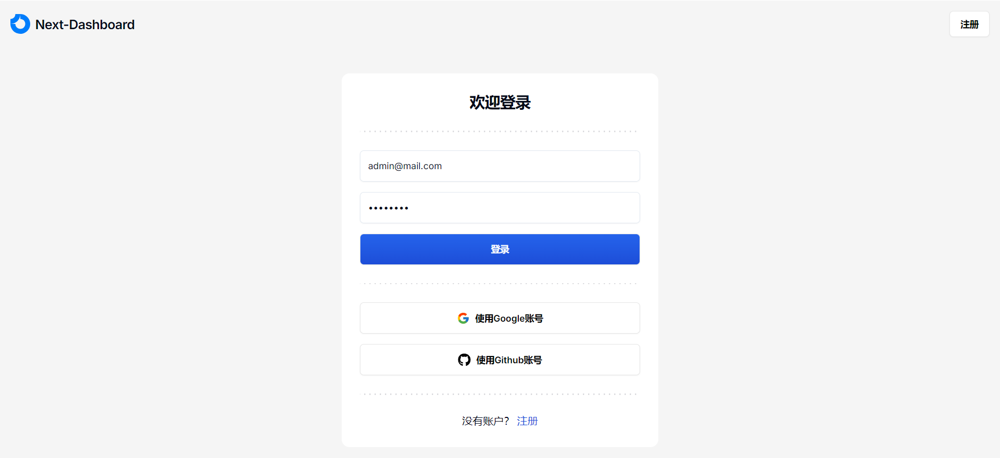
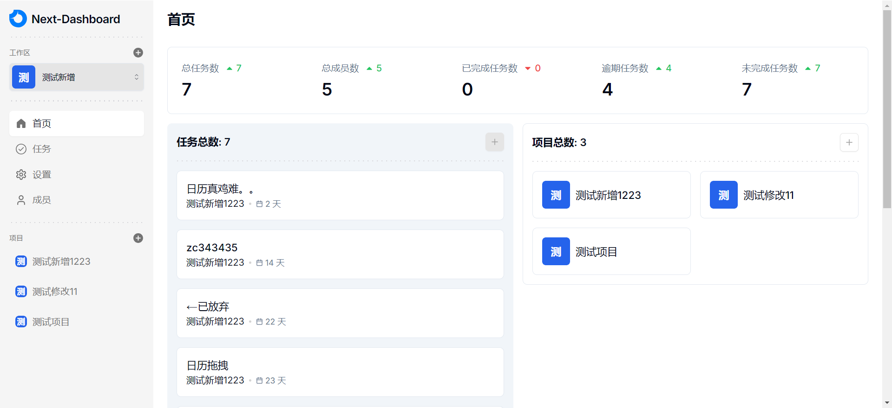
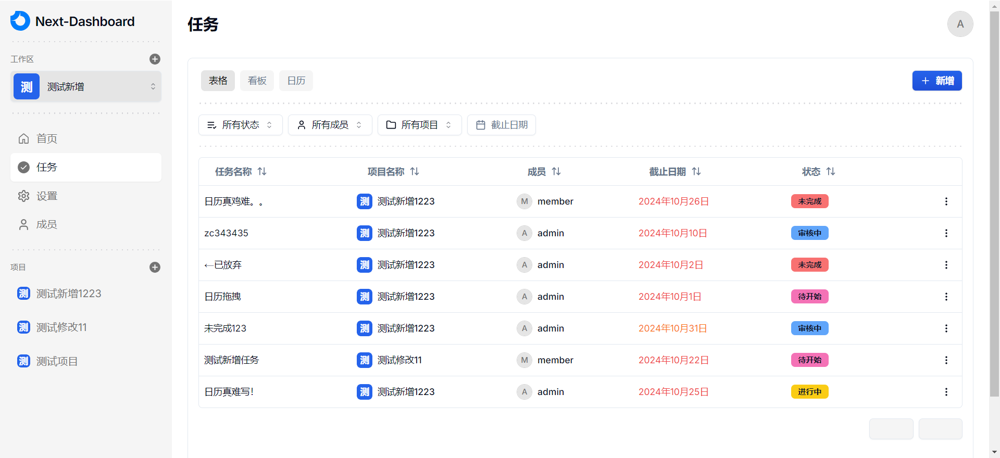
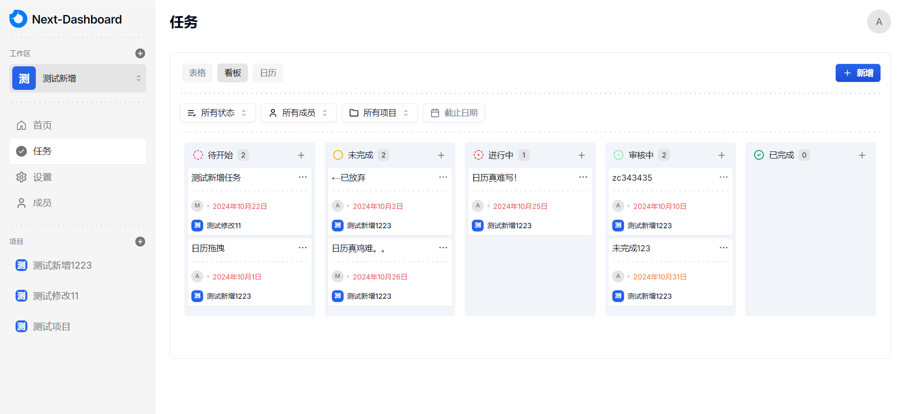
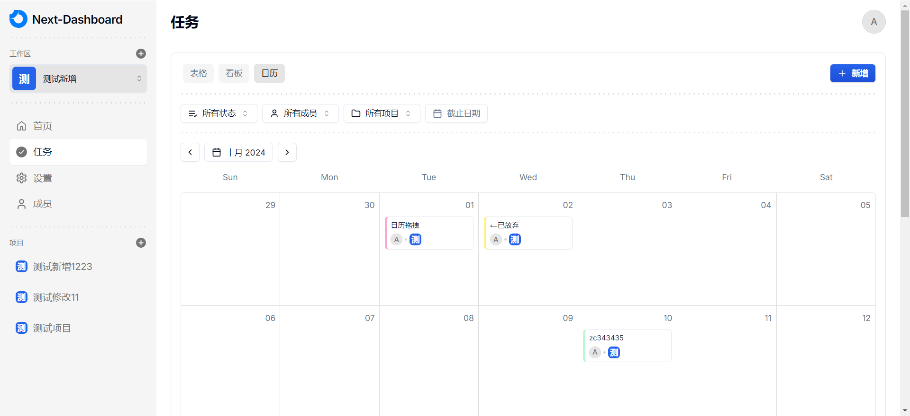

# Next-Dashboard

### 介绍

next dashboard，基于 Next.js、radix-ui、shadcn/ui、TailWind css、Appwrite 开源的一套后台管理框架。

### 一、在线预览地址

- Link(可能需要翻墙)：https://next-dashboard-zc.vercel.app

### 二、Git 仓库地址 (欢迎 Star⭐)

- GitHub：https://github.com/zczhao1992/next-dashboard

### 三、🔨🔨🔨 项目功能

- 🚀 采用最新技术找开发：Next14、TypeScript、shadcn/ui、Appwrite、Hono.js 等
- 🚀 支持身份认证，支持 Google、Github 账号登录
- 🚀 使用 appwrite 作为后端服务，及数据库、文件上传、账户权限于一体
- 🚀 整个项目集成了 TypeScript
- 🚀 使用 react-big-calendar 作为日历组件

### 四、安装使用步骤 📑

- **Clone：**

```text
# GitHub
git clone https://github.com/zczhao1992/next-dashboard.git
```

- **Install：**

```text
npm install
cnpm install

# npm install 安装失败，请升级 nodejs 到 16 以上，或尝试使用以下命令：
npm install --registry=https://registry.npm.taobao.org
```

- **Run：**

```text
npm run dev
```

- **Build：**

```text
# 开发环境
npm run build:dev

# 测试环境
npm run build:test

# 生产环境
npm run build:pro
```

### 五、项目截图

#### 1、登录页：



#### 2、首页：



#### 2、任务页：





### 六、文件资源目录 📚

```text
next-dashboard
├─ public                 # 静态资源文件（忽略打包）
├─ src
│  ├─ app                 # 项目页面
│  ├─ components          # 全局组件
│  ├─ features            # 业务功能
│  ├─ hooks               # 通用函数
│  ├─ lib                 # 工具方法
│  └─ config.ts           # 全局变量
├─ .gitignore             # git 提交忽略
├─ components.json        # shadcn/ui 组件配置
├─ next-env.d.ts          # 环境变量配置
├─ package-lock.json      # 依赖包包版本锁
├─ package.json           # 依赖包管理
├─ postcss.config.js      # postcss 配置
├─ README.md              # README 介绍
├─ tailwind.config.ts     # tailwind 配置
└─ tsconfig.json          # typescript 全局配置
```
